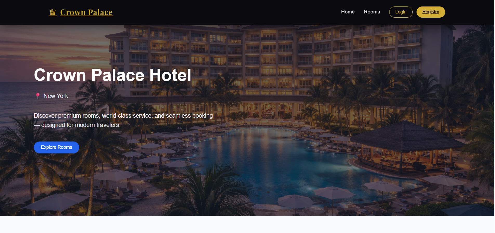
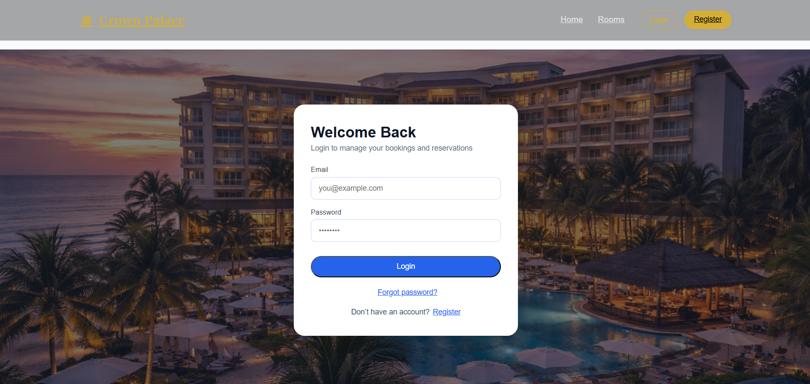
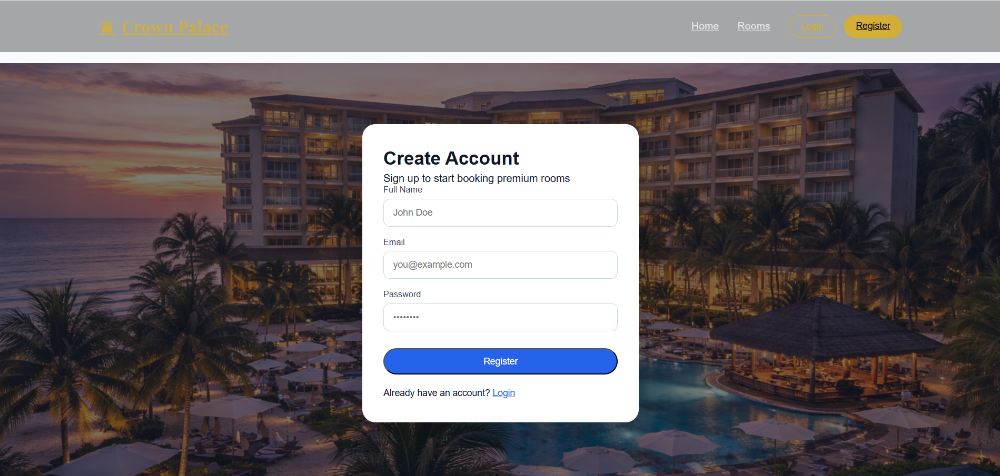
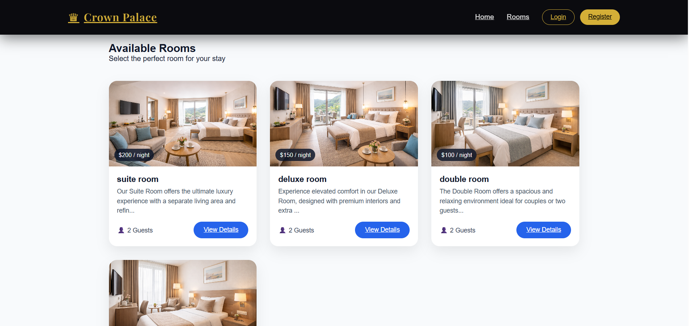
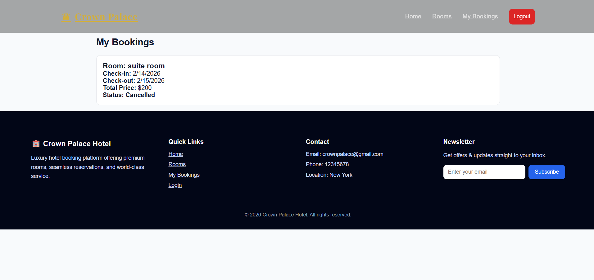

# 🏨 Hotel Management System – Full Stack MERN Application

A modern full-stack hotel management system built using the MERN stack.
This application allows users to browse rooms, book reservations, manage bookings, and receive email confirmations.

---

## 🚀 Live Demo

🌐 Frontend: https://hotel-management-system-chi-rose.vercel.app/  
🔗 Backend API: https://hotel-backend-dsii.onrender.com

---

## ✨ Features

- 🔐 JWT Authentication
- 🏨 Browse Available Rooms
- 📅 Room Booking System
- 📖 View My Bookings
- 📧 Email Notifications (Brevo API)
- 👨‍💼 Admin Management (if included)
- 📱 Fully Responsive UI
- 🌍 RESTful API Architecture

---

## 🛠 Tech Stack

### Frontend
- React (Vite)
- Tailwind CSS
- Axios

### Backend
- Node.js
- Express.js
- MongoDB
- Mongoose
- JWT Authentication
- Brevo Email API

---

## 📸 Screenshots

### 🏠 Home Page


### 🔐 Login


### 📝 Register


### 🏨 Rooms Listing


### 📅 My Bookings


---

## ⚙️ Installation

### Clone Repository

```
git clone https://github.com/MirAshique/hotel-management-system.git
```

### Backend Setup

```
cd Backend
npm install
npm run dev
```

### Frontend Setup

```
cd frontend
npm install
npm run dev
```

---

## 👨‍💻 Author

Hussain – Full Stack MERN Developer  
📧 ashiqtalpur18@gmail.com